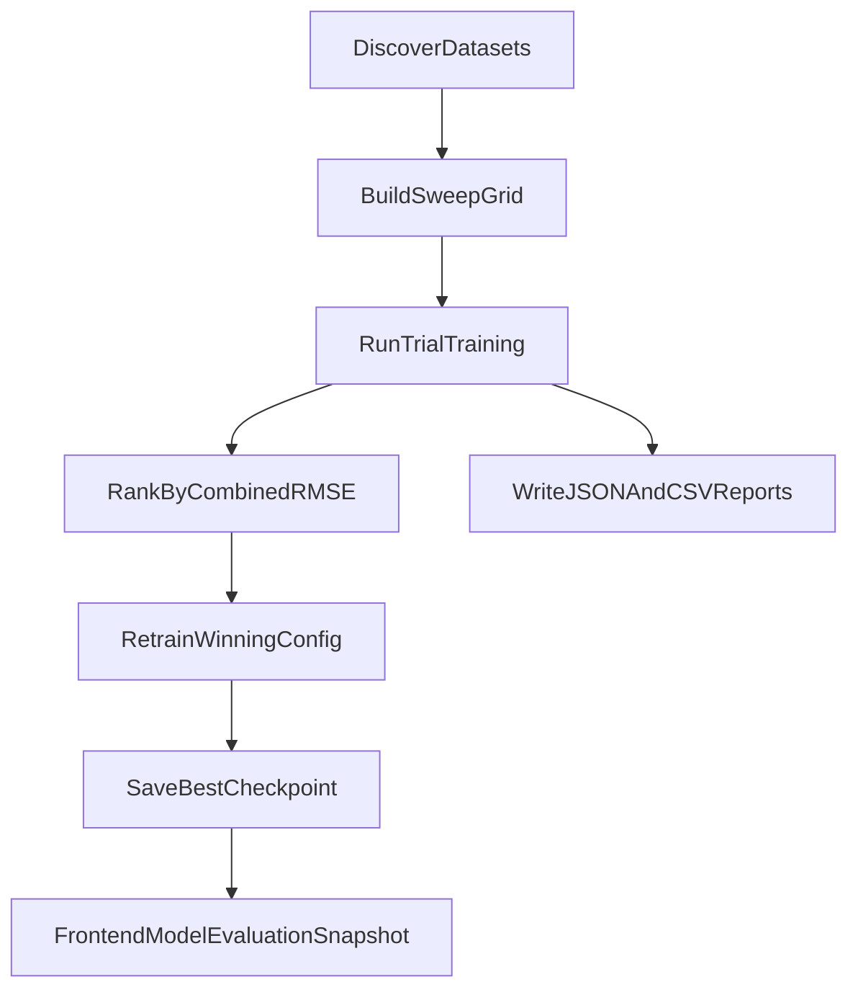

# System Design: Hybrid Quant Forecasting MVP

## Objective
Provide a single API workflow that combines text sentiment with market indicators and returns short-horizon forecasts for both close price and volatility.

## End-to-End Flow
1. Frontend sends `POST /analyze` with `text`, `date`, optional `symbol`, `forecast_mode`, `horizon`, and optional `include_realized`.
2. Backend `sentiment.py` runs transformer inference and returns normalized sentiment output.
3. Backend `market_data.py` fetches yfinance close history, applies trading-day look-back fallback, and computes a rolling volatility proxy.
4. Backend `forecaster.py` builds engineered feature vectors and selects mode:
   - `fast`: inference with the current best checkpoint or initialized singleton model
   - `quick_train`: bounded local fine-tuning on recent history before forecasting
5. API responds with `{ sentiment, prediction, market, series }`, including optional realized-forward overlay arrays when requested.

## Offline Training Flow
1. `scraper.py` writes raw FOMC statement/minutes documents under `data/`.
2. `prepare_training_data.py` reads raw documents, runs sentiment in bulk, fetches market snapshots for each configured symbol, and writes grouped records to `data/train_dataset.json`.
3. `train_forecaster.py` inspects `data/`, discovers usable grouped sequences, and either trains once or runs a hyperparameter sweep before saving the selected best checkpoint into `backend/models/`.

## Feature Construction
- **Sentiment features**
  - `score` from sentiment model output (0-1 scale).
- **Market features**
  - `close` price (normalized in forecaster by `/10000`).
  - `volatility_5d` from rolling standard deviation of percentage returns.
- **Engineered change signals**
  - `close_change_pct` derived from consecutive closes.
  - `volatility_change` derived from consecutive volatility observations.
- **Sequence policy**
  - Forecaster windows use last 5 points.
  - Historical chart context uses up to last 30 points.
  - Pads with earliest point when sequence length is insufficient.

## Forecaster Runtime
- Architecture:
  - configurable LSTM (`input_size=5`, `hidden_size`, `num_layers`, `dropout`, `head_hidden_size`)
  - normalized head with 2 outputs (`close`, `volatility`)
- Inference behavior:
  - singleton model instance with checkpoint reload support
  - `eval()` + `torch.no_grad()`
  - explicit CUDA usage when available
  - optional quick-train branch with bounded epochs
  - runtime response includes checkpoint diagnostics so the frontend can show which architecture is active
- Training behavior:
  - `train_model(...)` handles batching, validation split, LR scheduling, gradient clipping, and early stopping
  - each run reports validation loss plus `close_rmse`, `volatility_rmse`, and `combined_rmse`
  - checkpoint payload stores model architecture and training summary metadata
  - sweep mode ranks trials by validation `combined_rmse` and writes JSON/CSV reports
  - best weights are saved to `backend/models/forecaster_best.pt`
  - `backend/app/train_forecaster.py` is the canonical CLI entrypoint for larger offline training runs from `data/`
  - `backend/app/prepare_training_data.py` produces grouped training records from raw scraped documents before training
- Output:
  - scalar summary in `prediction.{close, volatility, horizon}`
  - `prediction.horizon` currently `3d`
  - model diagnostics under `model.*`
  - chart-ready arrays under `series.*` with optional realized overlays and volatility-axis suggestions

## Hyperparameter Search Flow

## Series Metadata
- `model.checkpoint_path`, `model.checkpoint_loaded`, `model.runtime_mode`
- `model.hidden_size`, `model.num_layers`, `model.dropout`, `model.head_hidden_size`
- optional quick-train adaptation metrics:
  - `model.adaptation_epochs_completed`, `model.adaptation_best_epoch`
  - `model.adaptation_loss`, `model.adaptation_combined_rmse`
- `series.timestamps`, `series.history_close`, `series.history_volatility`
- `series.forecast_timestamps`, `series.forecast_close`, `series.forecast_close_lower`, `series.forecast_close_upper`
- `series.forecast_volatility`, `series.forecast_volatility_lower`, `series.forecast_volatility_upper`
- `series.forecast_confidence_level`
- optional when `include_realized=true` and data is available:
  - `series.realized_timestamps`, `series.realized_close`, `series.realized_volatility`
- chart scaling aid:
  - `series.volatility_scale.{suggested_ymin,suggested_ymax}`

## Error Handling and Fallbacks
- Invalid date format returns `422`.
- Non-trading day requests use nearest prior trading day within look-back window.
- If no valid trading point exists in the look-back range, API returns a `500` pipeline error.
- Sentiment model uses fallback transformer when target model is unavailable.
- `forecast_mode` validation enforces `fast` or `quick_train`.
- `include_realized=true` is safe for past-date analyses; empty realized arrays are returned when future observations are unavailable.
- Training CLI reports unusable or insufficient `data/` files instead of failing silently.
- Sweep CLI retrains the winning configuration once before updating the persisted checkpoint.
- Preparation CLI skips invalid documents or symbol/date pairs instead of aborting the full batch.

## Docker Validation
- Backend tests can run fully inside Docker with:
  - `docker compose run --rm backend pytest tests/`
- Compose mounts `./tests` into `/app/tests` and exports `PYTHONPATH=/app` so test imports resolve inside the container.

## Service Modules
- `backend/app/services/scraper.py`
- `backend/app/services/sentiment.py`
- `backend/app/services/market_data.py`
- `backend/app/services/forecaster.py`
- `backend/app/prepare_training_data.py`
- `backend/app/train_forecaster.py`
- Orchestration in `backend/app/main.py`
